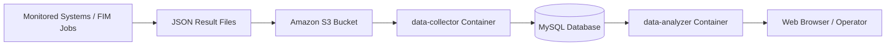
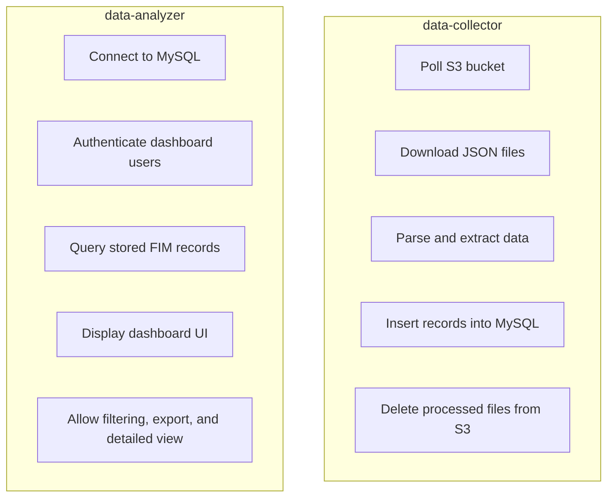
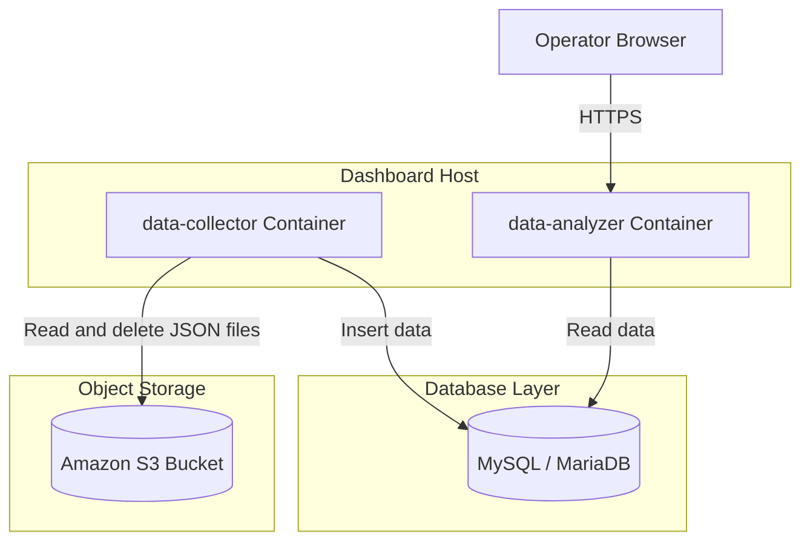

# File Integrity Monitor Dashboard

---

>**Note**: This is an **open-source project** developed by the WSO2 Infra team to improve operational efficiency, support auditing and evidence generation, and assist with server troubleshooting. Please note that this is an **ongoing development project**, and improved versions will be released in the future. This implementation represents the outcome of our current research efforts.

---

>**Please review the FIM-agent README.md file beforehand.**

The File Integrity Monitor (FIM) Dashboard is a centralized component used to collect, store, and visualize FIM results. It is built with two Docker containers:

- **data-collector**  
  A Python-based service that continuously pulls JSON result files from a configured Amazon S3 bucket, processes them, stores the extracted data in a MySQL database, and deletes the processed JSON files from S3.

- **data-analyzer**  
  A PHP + Apache-based web application that reads data from the MySQL database and presents it through a dashboard for analysis, filtering, and review.

In simple terms:

**S3 JSON files -> data-collector -> MySQL database -> data-analyzer -> Dashboard UI**

---

## What is this

This dashboard is the centralized reporting layer of the FIM solution.

Once FIM agents generate JSON result files and upload them to an S3 bucket, this dashboard provides a single place to collect, store, and visualize the results instead of reviewing each file manually.

### Main Purpose

- Collect FIM result JSON files from S3
- Store them in a central database
- Provide a web dashboard to view and analyze collected results
- Allow operators to inspect machine-level results and changed file details
- Support filtering and export for operational review

### End-to-End Flow

1. FIM-related processes generate result JSON files.
2. Those JSON files are uploaded to a configured S3 bucket.
3. The `data-collector` container polls the S3 bucket.
4. It downloads each JSON file and extracts the required fields.
5. It inserts those fields into the MySQL table.
6. After a successful insert, it deletes the processed JSON file from S3.
7. The `data-analyzer` container reads data from the same database.
8. It renders a dashboard where users can log in and review the FIM results.

---

## Architecture Diagram



### Component Responsibility Diagram



---

## Deployment Diagram



---

## Repository Structure

```text
dashboard/
├── data-collector/
│   ├── app/
│   │   └── data-collector.py
│   ├── certs/
│   └── Dockerfile
│
└── data-analyzer/
    ├── app/
    │   ├── dashboard.php
    │   ├── db_connect.php
    │   ├── device_summary.php
    │   ├── export_csv.php
    │   ├── login.php
    │   └── view_full_data.php
    ├── certs/
    ├── config/
    ├── ssl/
    └── Dockerfile
```

---

## How It Works

### 1. data-collector

The `data-collector` service handles data ingestion.

#### Main Tasks

- Connect to a configured S3 bucket
- Pull JSON files from the bucket
- Parse the JSON content
- Extract required values such as:
  - `machine_identifier`
  - `conclusion`
  - `human_readable_timestamp`
  - `readable_text_cmd`
  - `diff`
- Store those values in the MySQL database
- Delete the JSON file from S3 after successful processing
- Repeat the process continuously in a loop

#### Collector Data Flow

```text
S3 Bucket -> Download JSON -> Parse JSON -> Insert into DB -> Delete JSON from S3
```

### 2. data-analyzer

The `data-analyzer` service handles dashboard visualization.

#### Main Tasks

- Connect to the MySQL database
- Read stored FIM records
- Provide login-based access to the dashboard
- Display machine and result data
- Support filtering by date, machine, and result type
- Show detailed changed data and diff content
- Export results as CSV

#### Analyzer Data Flow

```text
MySQL DB -> Read Records -> Render Dashboard -> User Review / Filtering / Export
```

---

## Prerequisites

Before running the dashboard components, make sure the following are available:

- The `data-collector` and `data-analyzer` with `dashboard` folder should available on the centralized dashboard host
- Docker is installed on the host
- Access to an Amazon S3 bucket
- A MySQL-compatible database (Please see the `Database Setup Script` section)
- Database root user & credentials
- TLS certificates for database connectivity, if required
- HTTPS certificate and key for the dashboard web server
- Required environment variable values

---

## Expected JSON Input Format

The collector expects JSON result files in a structure similar to the following:

```json
{
  "machine_identifier": "host-01",
  "conclusion": "changed",
  "human_readable_timestamp": "2026-03-30 10:20:15",
  "readable_text_cmd": "diff -u baseline current",
  "diff": "full diff content here"
}
```

---

## Required Environment Variables

### data-collector Environment Variables

| Variable | Description |
|---|---|
| `AWS_ACCESS_KEY_ID` | AWS access key for S3 access |
| `AWS_SECRET_ACCESS_KEY` | AWS secret key for S3 access |
| `AWS_REGION` | AWS region |
| `S3_BUCKET_NAME` | S3 bucket containing JSON result files |
| `DB_HOST` | MySQL host |
| `DB_USER` | MySQL username |
| `DB_PASSWORD` or `DB_PASS` | MySQL password |
| `DB_NAME` | Database name |
| `DB_PORT` | Database port, usually `3306` |
| `DB_SSL_CA` | Path to CA certificate |
| `DB_SSL_CERT` | Path to client certificate |
| `DB_SSL_KEY` | Path to client key |
| `DB_SSL_VERIFY_CERT` | Enable certificate verification |
| `DB_SSL_VERIFY_IDENTITY` | Enable hostname identity verification |

### data-analyzer Environment Variables

| Variable | Description |
|---|---|
| `DB_HOST` | MySQL host |
| `DB_USER` | MySQL username |
| `DB_PASS` | MySQL password |
| `DB_NAME` | Database name |
| `DB_PORT` | Database port |
| `DASH_USER` | Dashboard login username |
| `DASH_PASS` | Dashboard login password |

---

## Certificates Required

### For Database TLS

Place these files in both:

- `data-collector/certs/`
- `data-analyzer/certs/`

Required files:

```text
ca.pem
client-cert.pem
client-key.pem
```

### For HTTPS in data-analyzer

Place these files in:

- `data-analyzer/ssl/`

Required files:

```text
server.crt
server.key
```

---

## Recommended Deployment Sequence

1. Create the required mysql database and table for FIM records
2. Add database TLS certificate files into both `certs/` folders
3. Add HTTPS certificate files into `data-analyzer/ssl/`
4. Build the Docker images
5. Start `data-collector`
6. Verify that data is being inserted into the database
7. Start `data-analyzer`
8. Verify login and dashboard access
9. Confirm the full pipeline works from S3 to the dashboard UI

---

## Operational Verification

### Verify data-collector

- Container starts successfully
- S3 access works correctly
- JSON files are downloaded
- Records are inserted into the database
- Processed JSON files are removed from S3

### Verify data-analyzer

- HTTPS endpoint is reachable
- Login page is displayed
- Dashboard login works
- Records are visible in the dashboard
- CSV export works
- Detailed diff view works

---

## FIM Dashboard Summary

The `dashboard/` folder provides the centralized dashboard pipeline for the File Integrity Monitor solution.

It contains:

- **data-collector** to move FIM result data from S3 into MySQL
- **data-analyzer** to read MySQL data and display it in a dashboard

### In summary

- Collect file integrity result files centrally
- Store them in a structured database
- Provide a user-friendly dashboard for monitoring and analysis

This makes FIM results easier to review, manage, and export from a single place.

